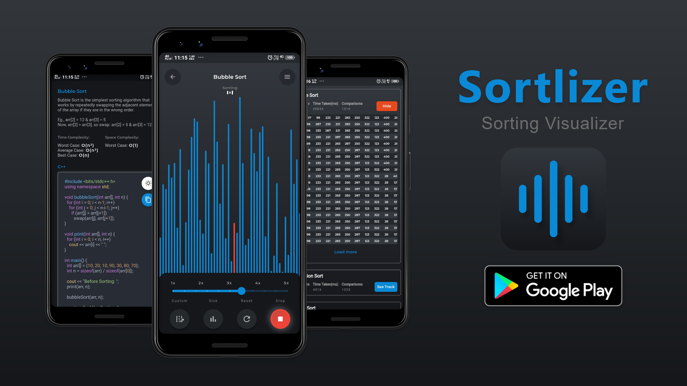
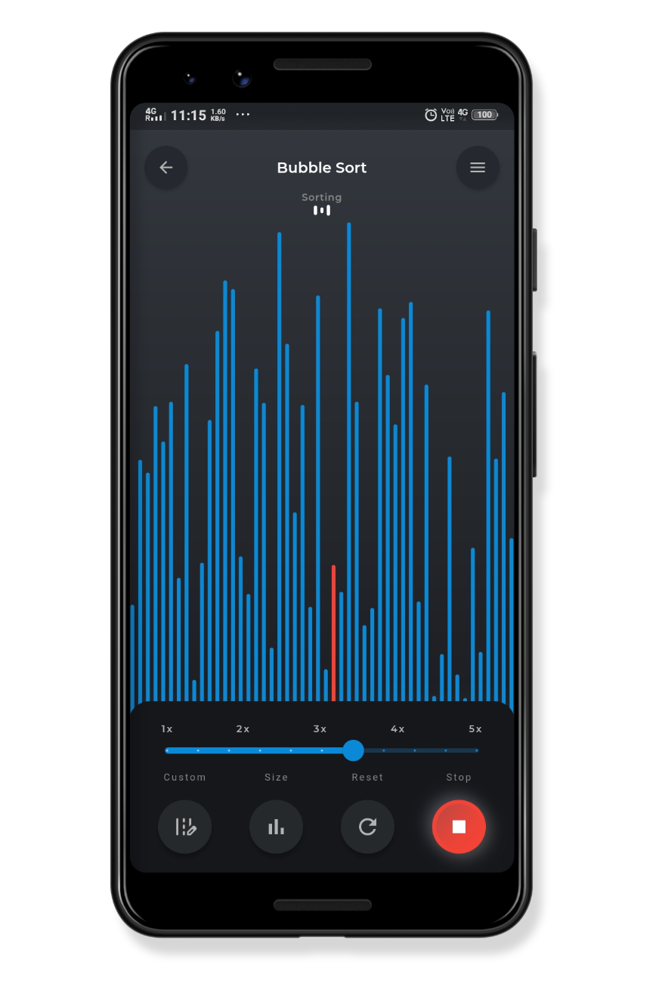
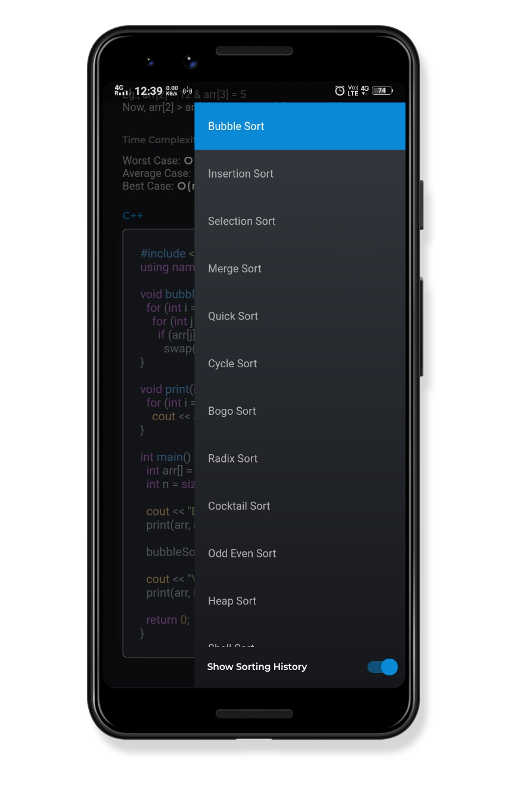
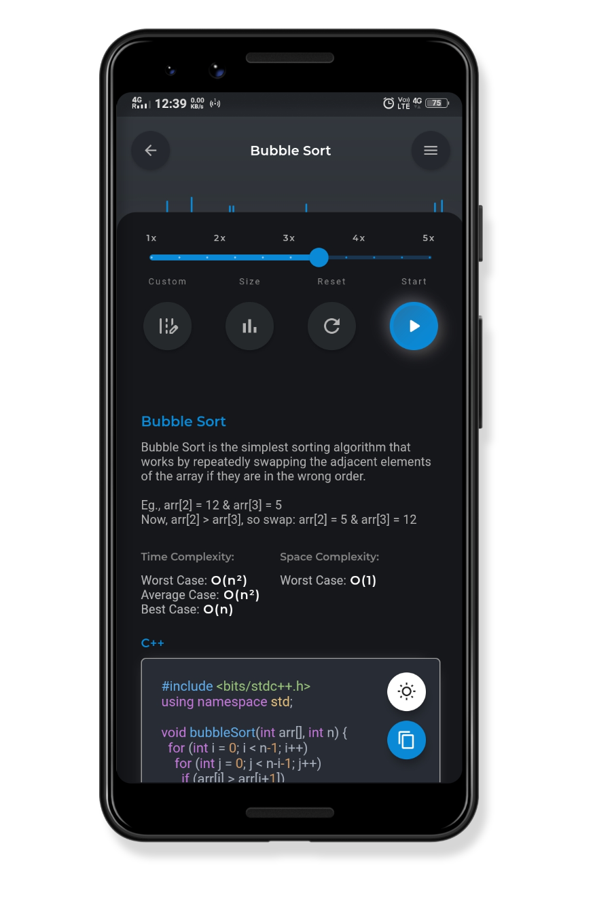
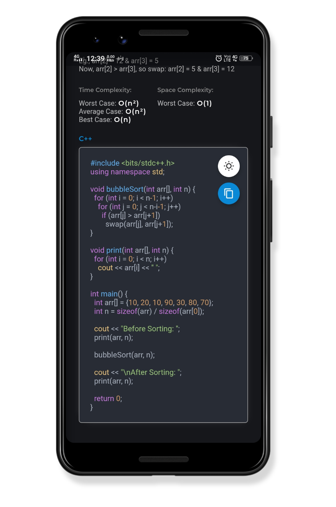
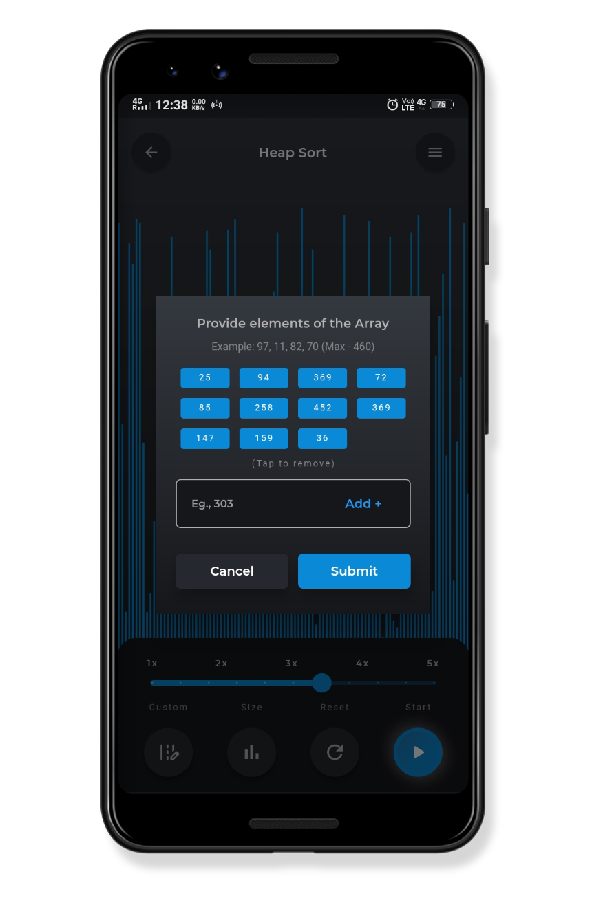
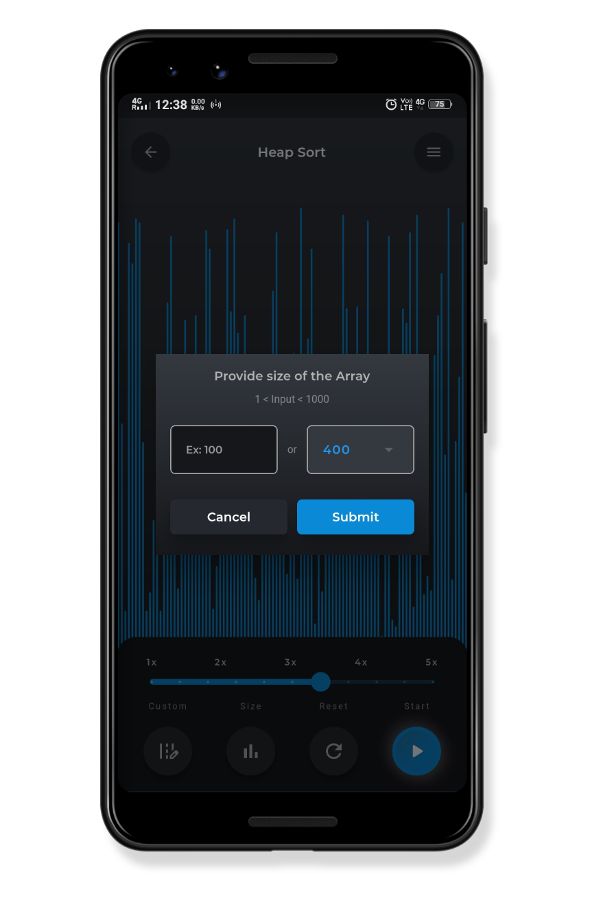
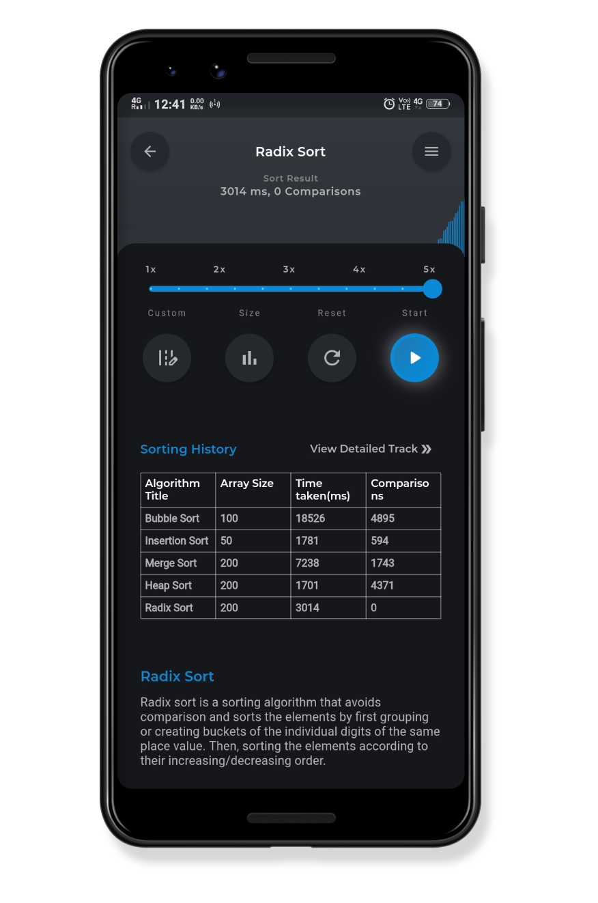
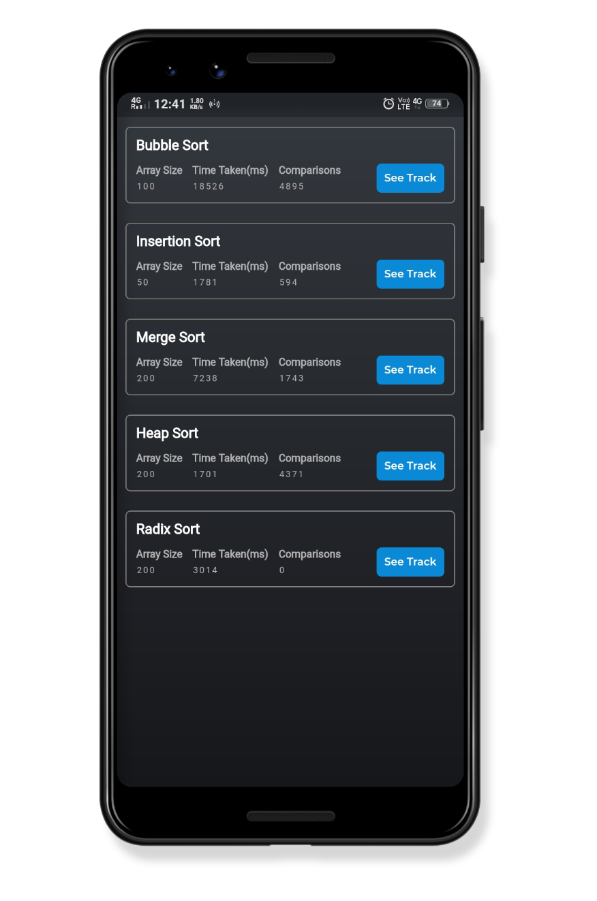
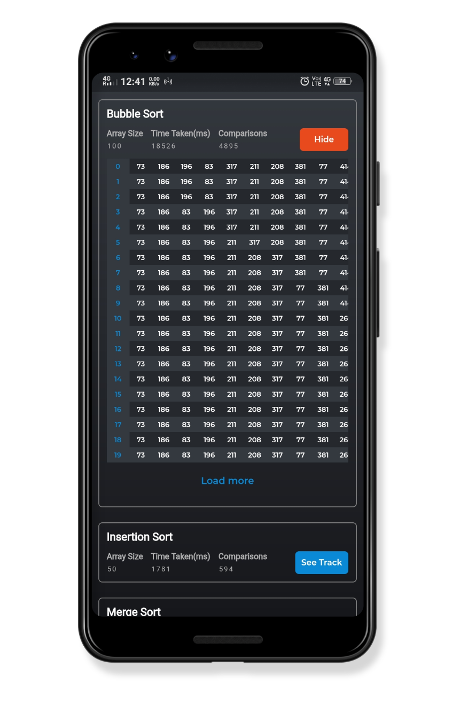

# Sortlizer  

[](https://github.com/roshan9419) [](https://github.com/roshan9419) [](https://github.com/roshan9419) [](https://github.com/roshan9419) [](https://github.com/roshan9419) [](https://github.com/roshan9419) [](https://github.com/roshan9419)
<br>

*An App to visualize various sorting algorithms...Developed using Flutter, followed MVVM pattern, and used stacked services.*  



## Play Store Link
https://play.google.com/store/apps/details?id=com.programmingtech.sortlizer

## Watch the demo here 👇👇👇
https://www.youtube.com/watch?v=g108TmmvwY0  

## Sorting Algorithms Included

```
1. Bubble Sort
2. Insertion Sort
3. Selection Sort
4. Merge Sort
5. Quick Sort
6. Cycle Sort
7. Bogo Sort
8. Radix Sort
9. Cocktail Sort
10. Odd Even Sort
11. Heap Sort
12. Shell Sort
13. Bead Sort
14. Gnome Sort
```

## Features

1. Provide your custom array to visualize with any algorithm.
2. Change array size, sorting speed.
3. Info on Algorithm (Including their complexities and code)
4. Saves the sorting history for in the form of table for current session for comparison of algorithms.
5. See the step-by-step formation of sorted array.

## Screenshots

<p float="left">
    
    
    
    
    
    
    
    
    
    
</p>

## Dependencies / Packages  

```
# State Management
stacked: ^1.7.6
stacked_hooks: ^0.1.3+1

# Navigation
auto_route: ^0.6.9
stacked_services: ^0.6.0+1
stacked_themes:

# Inversion of control
get_it:
injectable:

shared_preferences: ^0.5.10

animated_text_kit: any
flutter_highlight: 0.6.0
flutter_svg: 0.18.0

introduction_screen: 1.0.9

url_launcher: ^5.7.0
share: 0.6.5+4
```
```
build_runner:
auto_route_generator:
injectable_generator:

flutter_launcher_icons: ^0.8.1
flutter_native_splash: 0.3.2
```

## Getting Started

Use following command for code generation, when needed. Its usually needed if you are adding a new route or dependency injection for new services or new model with json annotations.

    flutter pub run build_runner build --delete-conflicting-outputs


## Author

Roshan Kumar (**roshan9419**)  

## License

This project is licensed under the MIT License - see the [LICENSE](LICENSE) file for details
